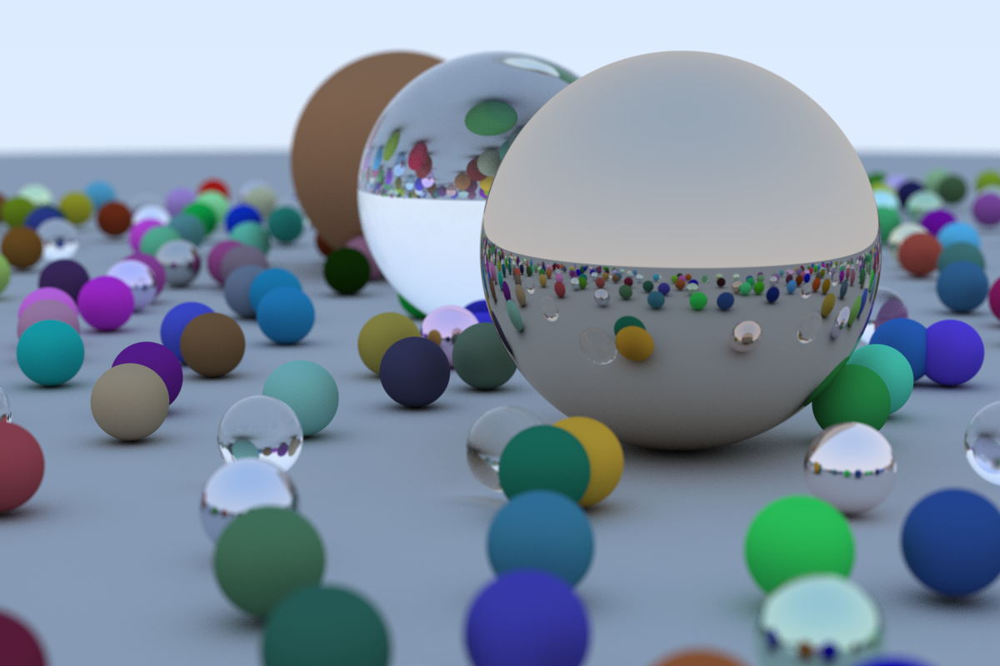

# A-simple-ray-tracer

## Introduction

This is a simple ray tracer project. It's implemented by following "[_Ray Tracing in One Weekend_](https://raytracing.github.io/books/RayTracingInOneWeekend.html)" book series.

[:construction: WIP :construction:]\
[Documentation](https://github.com/Naetw/A-simple-ray-tracer/wiki) in wiki page provides some background and additional detailed information. Some of them are not mentioned in the book series. You're highly encouraged to take a look for appreciating the beauty of the ray tracer.

## Features

Here are the features implemented so far:

TODO: wait for wiki

- 

## Images



This image can be generated by executing the following command after the build process has done:

```bash
./raytracer > final-image.ppm
```

Notice that this may requires a couple of hours (due to barely optimization). For faster rendering, you may need to adjust the resolution or samples per pixel of image by modifying the `image_width` or `samples_per_pixel` in `main.cpp` respectively.

## Build & Test

This project is built on C++ 14. Following are the mandatory software to build it:

- [CMake](https://cmake.org/) (3.10 or higher version)
- [Clang](https://clang.llvm.org) (support C++ 14)
	- You can replace it with any other compiler that support C++14 by modifying the [CMakelists.txt](./CMakeLists.txt)
- [Catch2](https://github.com/catchorg/Catch2) (2.x version)
	- I followed the instructions of [installing Catch2 from git repository](https://github.com/catchorg/Catch2/blob/v2.x/docs/cmake-integration.md#installing-catch2-from-git-repository). (:warning:: Remember to `git checkout` to branch v2.x before using the same way to install Catch2).

After all mandatory software are set up, follow the following instructions to build the ray tracer.

1. Execute CMake

```bash
mkdir build
cd build
cmake ..
```

You may specify any build system generator you like by using `-G` option. E.g., I'm using [Ninja](https://ninja-build.org): `cmake -G ninja ..`

2. Execute make

```bash
make
```

After process of `make` finished, there should be an executable `raytracer`. It is a simple example that generates a simple image in `stdout`.

3. Run test

If you're developing new features, you can run `ctest` making sure that previous functionalities are not broken.

```bash
ctest
```

If there's any failed test, just execute the executable of that test directly to see the cause of failure.
Executables of unittests are prefixed with "unittest_" and is placed under `unittests/`. For example:

```bash
./unittests/unittest_Camera
```
